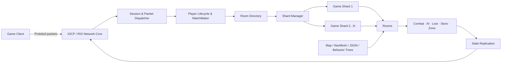

# ServerEngine

> C++20과 Windows 비동기 I/O를 기반으로 개발 중인 멀티플레이 게임 서버 엔진 및 **Time Thief** 전용 권위형 게임 서버입니다.

ServerEngine은 네트워크 연결과 패킷 처리만 제공하는 예제 서버가 아닙니다. IOCP/RIO 네트워크 백엔드, 멀티스레드 실행 환경, 패킷 세션, 충돌 판정 같은 범용 기반 계층과 매치메이킹, 룸 샤딩, 상태 복제, 몬스터 AI, 전투·경제 시스템을 포함하는 실제 게임 서버를 하나의 솔루션에서 개발합니다.

현재 저장소는 Windows와 Visual Studio 2022를 대상으로 활발히 개발 중입니다.

## 주요 특징

### 비동기 네트워크 코어

- Windows **IOCP** 기반의 기본 네트워크 백엔드
- 컴파일 타임에 선택할 수 있는 **Registered I/O(RIO)** 백엔드
- 비동기 Accept/Connect/Receive/Send 이벤트 처리
- 패킷 경계를 복원하는 스트림 세션과 송수신 버퍼
- 세션 수명 주기, 패킷 디스패처, 서버/클라이언트 샘플
- 스레드별 저장소(TLS)와 네트워크 워커 스레드 관리

### 샤딩된 게임 실행 구조

- CPU 코어 수를 기준으로 생성되는 다중 `GameShard`
- 샤드마다 독립적으로 동작하는 Job Queue, Timer Queue, Room Tick Scheduler
- 새 룸을 샤드에 라운드 로빈으로 배치
- 네트워크 I/O, 매치메이킹, 게임 룸 실행 책임 분리
- 설정 가능한 고정 룸 틱과 주기별 상태 복제

### 권위형 게임플레이

- 2~8인 매치메이킹과 대기 시간 기반 부분 매칭
- 플레이어, 몬스터, 보스, 투사체, 상자, 상점, 월드 아이템 관리
- 이동, 조준, 사격, 재장전, 무기 교체, 수류탄, 와이어 액션 처리
- 체력, 피격, 사망, 부활, 드롭, 루팅, 인벤토리, 상점, 업그레이드
- 축소 구역과 게임 종료 조건
- 시간 가속, 잔상, 되감기 등 Time Thief 고유 스킬
- Dirty Object와 이벤트를 분리한 플레이어/몬스터/투사체 상태 복제

### 서버 측 월드 시뮬레이션

- AABB, OBB, Sphere, Capsule, Character Capsule 충돌체
- 충돌체 조합별 Narrow Phase 판정과 Raycast
- 서버 맵, Uniform Grid 공간 인덱스, NavMesh 질의
- BehaviorTree.CPP 기반 데이터 주도형 NPC/보스 AI
- JSON 테이블과 XML Behavior Tree로 관리하는 게임 데이터

## 아키텍처



애플리케이션은 네트워크 워커, 매치메이킹 루프, 게임 샤드를 별도 실행 단위로 운용합니다. 외부 스레드에서 발생한 작업은 대상 샤드의 Job Queue에 전달되고, 각 샤드는 자신이 소유한 룸의 타이머와 틱을 순차적으로 처리합니다. 이 구조는 룸 내부 상태 변경을 한 실행 문맥에 모아 동시성 경계를 단순하게 유지하기 위한 설계입니다.

## 기술 스택

| 구분 | 사용 기술 |
| --- | --- |
| Language | C++20 |
| Platform | Windows x64 |
| Toolchain | Visual Studio 2022, MSVC v143, MSBuild, CMake |
| Networking | Winsock2, IOCP, Registered I/O |
| Protocol | Protocol Buffers, 공용 ProtocolShared 서브모듈 |
| Data | JsonCpp, JSON, XML, 자체 바이너리 맵/NavMesh 포맷 |
| AI | BehaviorTree.CPP |
| Math / Concurrency | GLM, oneTBB, Boost |
| Dependencies | vcpkg manifest |

## 저장소 구조

```text
ServerEngine/
├─ ServerEngineLib/       # 네트워크, 스레드, 버퍼, 수학, 충돌 등 범용 정적 라이브러리
├─ TimeThiefServer/       # Time Thief 권위형 게임 서버
│  ├─ Content/            # Actor, Component, 전투 및 게임플레이 모델
│  ├─ Data/               # 맵, 내비게이션, AI, JSON 테이블 로더
│  ├─ Network/            # 세션 수명 주기와 패킷 라우팅
│  ├─ Service/            # 매치메이킹, 플레이어, 룸, 타이머, 게임 시스템
│  ├─ Shard/              # 샤드 실행과 룸 분배
│  └─ config/             # 서버 설정 및 런타임 게임 데이터
├─ SampleServer/          # 네트워크 코어 사용 예제 서버
├─ SampleClient/          # 연결 및 반복 요청 예제 클라이언트
├─ External/
│  ├─ ProtocolShared/     # 서버/클라이언트 공용 Protobuf 프로토콜
│  └─ protobuf/           # 고정 버전 Protobuf 소스
├─ Tools/                 # Protobuf 빌드 도구
└─ ServerEngine.sln       # Visual Studio 솔루션
```

## 시작하기

### 요구 사항

- Windows 10/11 x64
- Visual Studio 2022 또는 Build Tools
  - Desktop development with C++
  - MSVC v143
  - Windows SDK
- CMake (`PATH` 등록 필요)
- Git
- vcpkg

> 프로젝트 파일은 `vcpkg_installed/x64-windows`를 참조하므로 현재는 **x64 빌드**를 권장합니다.

### 1. 저장소와 서브모듈 받기

```powershell
git clone --recurse-submodules https://github.com/niche0905/ServerEngine.git
cd ServerEngine
```

이미 저장소를 받은 경우에는 다음 명령으로 서브모듈을 초기화합니다.

```powershell
git submodule update --init --recursive
```

### 2. vcpkg 의존성 설치

저장소 루트의 `vcpkg.json`에는 JsonCpp, Boost, BehaviorTree.CPP, GLM, oneTBB가 선언되어 있습니다.

```powershell
vcpkg install --triplet x64-windows --x-install-root=vcpkg_installed
```

### 3. Protobuf 빌드

```powershell
.\Tools\build_protobuf.ps1 -Config Debug
```

Release 빌드가 필요하면 `-Config Release`를 사용합니다. 스크립트는 `External/protobuf_build/<Config>`에 `protoc.exe`와 정적 Protobuf 라이브러리를 생성합니다.

### 4. 서버 빌드

Visual Studio에서 `ServerEngine.sln`을 열고 아래 구성을 선택합니다.

```text
Configuration: Debug 또는 Release
Platform:      x64
Startup:       TimeThiefServer
```

명령줄에서는 Developer PowerShell for VS 2022에서 다음과 같이 빌드할 수 있습니다.

```powershell
msbuild ServerEngine.sln /t:TimeThiefServer /p:Configuration=Debug /p:Platform=x64 /m
```

빌드 과정에서 `TimeThiefServer/config` 디렉터리가 실행 파일 출력 위치로 복사됩니다.

### 5. 서버 실행

서버는 `--config=<파일 경로>` 형식으로 설정 파일을 받습니다.

```powershell
.\TimeThiefServer.exe --config=.\config\server.dev.json
```

기본 개발 설정은 `0.0.0.0:8252`에서 게임 연결을 수신하며, 실제 경로는 실행 파일 위치를 기준으로 지정하면 됩니다.

## 설정과 게임 데이터

`TimeThiefServer/config/server.dev.json`에서 다음 항목을 조정할 수 있습니다.

- 서버 바인딩 IP와 게임 포트
- 이동 상태 전송 주기, Ping 주기, 룸 Tick 간격
- 매치 인원, 부분 매칭 인원 및 대기 시간
- 초기 재화, 부활 비용, 처치 보상, 상자 보상 범위
- 맵, NavMesh, 배치 데이터, 각종 게임 테이블 경로

상대 경로로 지정한 데이터 파일은 설정 파일이 있는 디렉터리를 기준으로 해석됩니다. 런타임 데이터는 용도에 따라 분리되어 있습니다.

| 데이터 | 역할 |
| --- | --- |
| `.servermap` | 서버 충돌 및 공간 질의용 맵 |
| `*_NavMesh.bin` | 서버 NPC 경로 탐색 |
| `placements/*.json` | 몬스터와 상호작용 오브젝트 배치 |
| `tables/*.json` | 무기, 스킬, 업그레이드, 전리품, 상점, 존 설정 |
| `npc/behavior/*.xml` | Behavior Tree 정의 |

## 네트워크 백엔드 전환

기본 빌드는 IOCP를 사용합니다. RIO 구현은 `ServerEngineLib/Network/IoBackend.h`의 `USE_RIO` 전처리 정의를 활성화하면 선택됩니다.

RIO는 등록 버퍼 풀과 별도 세션/이벤트 구현을 사용하므로, 전환 후에는 대상 Windows 환경에서 연결·송수신 동작을 다시 검증하는 것을 권장합니다.

## 프로젝트 상태

이 프로젝트는 현재 개발 중이며 API와 데이터 포맷이 변경될 수 있습니다. 구현되어 있는 주요 흐름은 다음과 같습니다.

- 비동기 서버 기동, 세션 연결/해제, 패킷 프레이밍과 라우팅
- 플레이어 등록, 매치메이킹, 샤드 선택, 룸 생성과 종료
- 룸 Tick, 타이머, 게임 오브젝트 수명 주기와 상태 복제
- 전투, 몬스터 AI, 아이템/재화, 상점/강화, 존 진행과 승패 처리
- 서버 맵 충돌, Raycast, 공간 인덱스, NavMesh 기반 이동
